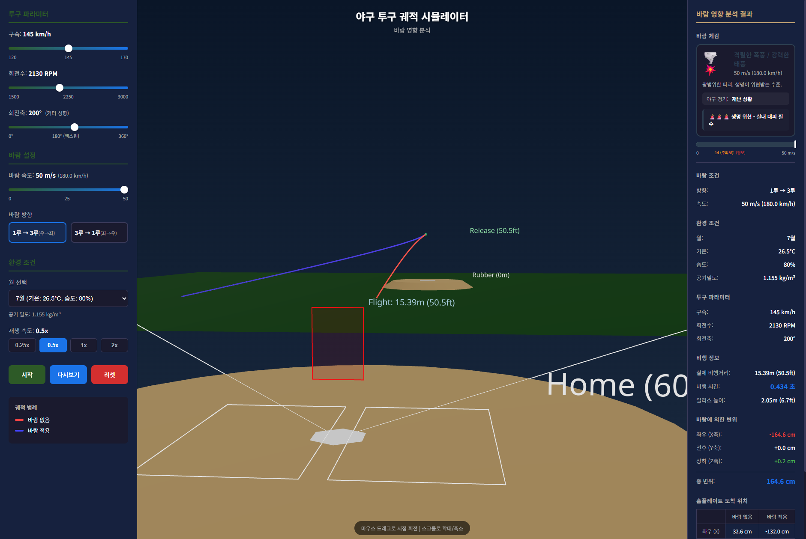

# Baseball Pitch Trajectory Simulator - Side Wind Effect Analysis

야구 투구 궤적 시뮬레이터 - 측풍(Side Wind) 영향 분석 웹 애플리케이션

## Overview

투수가 던진 공이 마운드에서 홈플레이트까지 이동하는 궤적을 3D로 시뮬레이션하고, 측풍이 궤적에 미치는 영향을 정량적으로 분석하는 웹 애플리케이션입니다.



## Features

### 1. 3D Baseball Field Visualization
- 마운드 (높이: 0.254m / 10인치)
- 투수판 및 릴리스 포인트 표시
- 홈플레이트, 배터박스, 스트라이크존
- 파울라인 및 거리 마커

### 2. Physics Engine
- **마그누스 효과 (Magnus Effect)**: 회전수(RPM)와 회전축(Spin Axis)에 따른 공의 휨 계산
- **공기저항 (Drag Force)**: 공기 밀도와 속도에 따른 감속 계산
- **바람 영향 (Wind Effect)**: 측풍에 의한 궤적 변화 계산

### 3. Pitch Parameters
| Parameter | Range | Unit |
|-----------|-------|------|
| 구속 (Velocity) | 120 ~ 170 | km/h |
| 회전수 (Spin Rate) | 1500 ~ 3000 | RPM |
| 회전축 (Spin Axis) | 0 ~ 360 | degrees |
| 바람 속도 (Wind Speed) | 0 ~ 50 | m/s |

### 4. Environmental Conditions
한국 프로야구 시즌 기준 월별 평균 환경 조건:

| Month | Temperature | Humidity | Air Density |
|-------|-------------|----------|-------------|
| 4월 | 12.5°C | 55% | 1.235 kg/m³ |
| 5월 | 18.0°C | 62% | 1.205 kg/m³ |
| 6월 | 23.5°C | 72% | 1.175 kg/m³ |
| 7월 | 26.5°C | 80% | 1.155 kg/m³ |
| 8월 | 27.0°C | 78% | 1.150 kg/m³ |
| 9월 | 22.5°C | 68% | 1.180 kg/m³ |
| 10월 | 15.5°C | 58% | 1.220 kg/m³ |

### 5. Wind Feeling Scale
바람 속도별 체감 및 야구 경기 영향도:

| Wind Speed | Description | Game Impact |
|------------|-------------|-------------|
| 0-2 m/s | 고요한 바람 | 영향 없음 |
| 2-4 m/s | 가벼운 산들바람 | 거의 영향 없음 |
| 4-6 m/s | 부드러운 바람 | 미미한 영향 |
| 6-8 m/s | 약간 강한 바람 | 투구에 눈에 띄는 영향 |
| 8-11 m/s | 센 바람 | 타구에 상당한 영향 |
| 11-14 m/s | 강한 바람 | 경기 진행 어려움 (주의보) |
| 14-17 m/s | 돌풍 | 경기 중단 고려 |
| 17+ m/s | 폭풍급 | 경기 불가능 (경보) |

## Technical Details

### Pitch Distance
- **투수판 ~ 홈플레이트**: 18.44m (60.5ft)
- **실제 릴리스 포인트 ~ 홈플레이트**: 15.39m (50.5ft)
- **릴리스 높이**: ~2.05m (마운드 높이 + 투수 릴리스 높이)

### Strike Zone Target
- 스트라이크존 중앙 (높이 약 0.8m)을 목표로 투구
- 바람이 없을 때 스트라이크존 중앙에 도달하도록 설계

### Trajectory Comparison
- **빨간색 궤적**: 바람 없음 (기준선)
- **파란색 궤적**: 바람 적용 (변화량 측정)

## Installation

```bash
# Clone repository
git clone https://github.com/mingksong/flightSIM_sideWindEffect.git
cd flightSIM_sideWindEffect

# Install dependencies
npm install

# Start development server
npm run dev
```

## Usage

1. 브라우저에서 `http://localhost:15000` 접속
2. 왼쪽 패널에서 투구 파라미터 설정
   - 구속, 회전수, 회전축 조절
   - 바람 속도 및 방향 설정
   - 월별 환경 조건 선택
3. **시작** 버튼 클릭하여 시뮬레이션 실행
4. 3D 뷰에서 마우스 드래그로 시점 회전, 스크롤로 확대/축소
5. 오른쪽 패널에서 바람 영향 분석 결과 확인

## Tech Stack

- **Frontend**: React 18
- **3D Rendering**: Three.js, @react-three/fiber, @react-three/drei
- **Build Tool**: Vite
- **Physics**: Custom JavaScript physics engine

## Project Structure

```
flightSIM_sideWindEffect/
├── src/
│   ├── components/
│   │   ├── BaseballField.jsx    # 3D 야구장 및 궤적 렌더링
│   │   ├── Scene3D.jsx          # Three.js 씬 설정
│   │   ├── ControlPanel.jsx     # 사용자 입력 UI
│   │   └── ResultPanel.jsx      # 결과 표시 패널
│   ├── utils/
│   │   └── physics.js           # 물리 엔진 (마그누스, 항력, 바람)
│   ├── styles/
│   │   └── main.css             # 스타일시트
│   ├── App.jsx                  # 메인 앱 컴포넌트
│   └── main.jsx                 # 엔트리 포인트
├── data/
│   └── savant_data.csv          # Baseball Savant 데이터 (참고용)
├── index.html
├── package.json
├── vite.config.js
└── README.md
```

## Data Source

- **Baseball Savant** (baseballsavant.mlb.com): 투구 데이터 구조 및 평균값 참고
- **한국 기상청**: 월별 평균 기온/습도 데이터

## Physics Formulas

### Magnus Force
```
F_magnus = 0.5 × ρ × v² × C_L × A
```
- ρ: 공기 밀도 (kg/m³)
- v: 공의 속도 (m/s)
- C_L: 양력 계수 (회전수에 비례)
- A: 공의 단면적 (m²)

### Drag Force
```
F_drag = 0.5 × ρ × v² × C_D × A
```
- C_D: 항력 계수 (약 0.35)

### Wind Effect
측풍에 의한 추가 횡력 계산, 비행 시간 동안 누적되는 변위 산출

## License

MIT License

## Author

Created with Claude Code

---

**Note**: 이 시뮬레이터는 교육 및 연구 목적으로 제작되었으며, 실제 야구 경기 데이터와 다를 수 있습니다.
